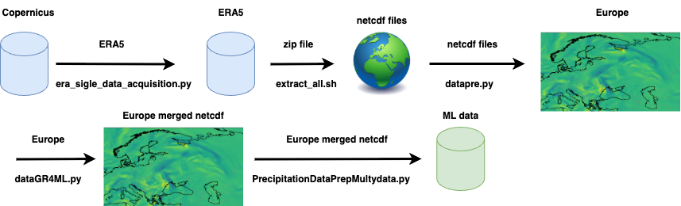

# GeoML-Lab
GeoML is a repository dedicated to exploring and advancing machine learning applications in Earth observation.
This lab serves as a collection of projects, tutorials, and experiments focused on processing multi-spectral and 
multi-temporal remote sensing data using state-of-the-art deep learning techniques. From building basic autoencoders 
for grayscale imagery to developing sophisticated convolutional and 3D autoencoders for multi-channel, time-series data, 
GeoML-Lab aims to empower researchers and practitioners to unlock the full potential of Earth observation in environmental 
monitoring, land cover classification, and beyond. Contributions and collaborations are warmly welcomed!

## 🌍 ERA5 Data Pipeline: A Starting Point for Climate-Driven ML

As part of this growing initiative, we have begun developing practical workflows for working with key Earth observation datasets. One of the first components of this effort is the [era5_data_pipeline](https://github.com/vasileios27/GeoML-Lab/tree/main/era5_data_pipeline) folder, which contains a complete pipeline for downloading, processing, and preparing ERA5 reanalysis data. This includes automated data acquisition scripts, preprocessing routines, and utilities designed to streamline the use of climate reanalysis data in machine learning workflows.

  

Figure: Overview of the ERA5 data pipeline, from acquisition via Copernicus to the generation of machine learning-ready datasets. The pipeline includes data extraction, NetCDF handling, merging, and regional preprocessing for Europe.

## Comparative Forecasting of Extreme Weather: AI vs NWP Models

The project focuses on the evaluation and application of advanced AI models for forecasting extreme weather events, with an emphasis on severe precipitation. These models will be compared against established Numerical Weather Prediction (NWP) systems to assess their relative performance. Using long-term reanalysis datasets such as ERA5, the goal is to train and test deep learning architectures capable of predicting rare and intense phenomena. Ultimately, the project aims to measure their accuracy under real-world extreme conditions and explore their potential integration into future early-warning systems.

---

© 2025 — Developed as part of the GeoML-Lab initiative.