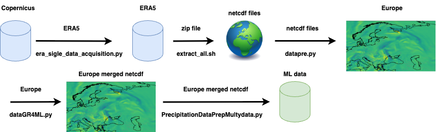

# GeoML-Lab
GeoML is a repository dedicated to exploring and advancing machine learning applications in Earth observation.
This lab serves as a collection of projects, tutorials, and experiments focused on processing multi-spectral and 
multi-temporal remote sensing data using state-of-the-art deep learning techniques. From building basic autoencoders 
for grayscale imagery to developing sophisticated convolutional and 3D autoencoders for multi-channel, time-series data, 
GeoML-Lab aims to empower researchers and practitioners to unlock the full potential of Earth observation in environmental 
monitoring, land cover classification, and beyond. Contributions and collaborations are warmly welcomed!

## Repository structure

| Section | Description | Link |
|---|---|---|
| EO Tutorials | Tutorials and examples for Earth observation data handling, preprocessing, and machine learning workflows. | [eo_tutorials](./eo_tutorials) |
| Extreme Value Analysis | Workflows for extreme value analysis, return-level estimation, and extreme precipitation threshold generation. | [extremes](./extremes) |

## 🌍 ERA5 Data Pipeline: A Starting Point for Climate-Driven ML

As part of this growing initiative, we have begun developing practical workflows for working with key Earth observation datasets. One of the first components of this effort is the [era5_data_pipeline](https://github.com/vasileios27/GeoML-Lab/tree/main/era5_data_pipeline) folder, which contains a complete pipeline for downloading, processing, and preparing ERA5 reanalysis data. This includes automated data acquisition scripts, preprocessing routines, and utilities designed to streamline the use of climate reanalysis data in machine learning workflows.

  

Figure: Overview of the ERA5 data pipeline, from acquisition via Copernicus to the generation of machine learning-ready datasets. The pipeline includes data extraction, NetCDF handling, merging, and regional preprocessing for Europe.

## Comparative Forecasting of Extreme Weather: AI Models

The project focuses on the evaluation and application of advanced AI models for forecasting extreme weather events, with an emphasis on severe precipitation. These models will be compared against each other to assess their relative performance. Using long-term reanalysis datasets such as ERA5, the goal is to test deep learning architectures capable of predicting rare and intense phenomena. Ultimately, the project aims to measure their accuracy under real-world extreme conditions and explore their potential integration into future early-warning systems.

---

### AI Models Selected for Medium-Range Extreme Weather Forecasting

The following state-of-the-art global weather forecasting models are considered for evaluating their potential in medium-range extreme weather forecasting, with particular focus on total precipitation (`tp`) and severe precipitation events.

The table highlights the main input/output variables reported for each model and whether total precipitation is directly included.

| Model / Paper | Variables | Tags |
| --- | --- | --- |
| **GraphCast** — [Learning skillful medium-range global weather forecasting](https://doi.org/10.1126/science.adi2336) | **Atmospheric:** `z`, `q`, `t`, `u`, `v`, `w`   **Surface:** `2t`, `10u`, `10v`, `msl`, `tp` | `#GraphCast`   `#tp` |
| **GenCast** — Probabilistic weather forecasting with machine learning | **Atmospheric:** `z`, `q`, `t`, `u`, `v`, `w`   **Surface:** `2t`, `10u`, `10v`, `msl`, `sst`, `tp`   **Static:** `z`, `lsm`, latitude, longitude, local time of day, elapsed year progress | `#GenCast`   `#tp` |
| **FourCastNet** — [A Global Data-driven High-resolution Weather Model using Adaptive Fourier Neural Operators](https://doi.org/10.48550/arXiv.2202.11214) | **Atmospheric:** `z`, `t`, `u`, `v`, `RH`   **Surface:** `2t`, `10u`, `10v`, `msl`, `sp`, `mlsp`, `tp`   **Integrated:** `TCWV` | `#FourCastNet`   `#tp` |
| **Pangu-Weather** — [Accurate medium-range global weather forecasting with 3D neural networks](https://doi.org/10.1038/s41586-023-06185-3) | **Atmospheric:** `z`, `q`, `t`, `u`, `v`   **Surface:** `2t`, `10u`, `10v`, `mslp` | `#PanguWeather`   `#No-tp` |
| **FengWu** — FengWu: Pushing the Skillful Global Medium-range Weather Forecast beyond 10 Days Lead | **Pressure levels:** `z`, `r`, `u`, `v`, `t`   **Surface:** `t2m`, `u10`, `v10`, `msl` | `#FengWu`   `#No-tp` |
| **SFNO** — Spherical Fourier Neural Operators: Learning Stable Dynamics on the Sphere | **Surface:** `10u`, `10v`, `2t`, `sp`, `msl`, `TCWV`, `100U`, `100V`   **Pressure levels:** `Z`, `T`, `U`, `V`, `R` | `#SFNO`   `#No-tp` |
| **Keisler GNN** — Forecasting Global Weather with Graph Neural Networks | `T`, `Z`, `Q`, `U`, `V`, `W` | `#Keisler`   `#No-tp` |
| **Aurora** — A Foundation Model for the Earth System | **Atmospheric:** `z`, `q`, `t`, `u`, `v`   **Surface:** `2t`, `10u`, `10v`, `msl`   **Static:** `z`, `lsm`, `slt` | `#Aurora`   `#No-tp` |

---
### What We Define as an Extreme Event

Within **GeoML-Lab**, an *extreme event* refers to an atmospheric or hydrological occurrence that significantly deviates from climatological norms, producing severe societal or environmental impacts.
👉 For more detailed explanations, visual examples, and regional thresholds, see:
📘 [**Extreme Event Definitions and Examples**](./extremes/README.md)

That document includes:

* Graphical examples (precipitation maps, wind fields)
* ERA5 percentile calculations for threshold selection
* Regional criteria for flood-triggering rainfall events
* Notes on labeling and event catalog generation for training models

---
### Detailed Model Instructions and Usage

A full technical overview—including **setup guides**, **input/output formats**, and **evaluation workflows**—is provided in the supplementary documentation:

👉 [**FoureCastNet**](https://github.com/vasileios27/GeoML-Lab/blob/main/containers/fourcastnet/README.md)  
👉 [**GraphCast**](https://github.com/vasileios27/GeoML-Lab/blob/main/containers/graphcast/README.md)

That page contains:

* Installation and environment setup for each model
* Data preprocessing workflow using ERA5 reanalysis
* Evaluation metrics (SSIM, RMSE, Bias, CSI, aggragated metrics)
* Benchmark scripts for comparing extreme-forecast performance

## Acknowledgements

GCP resources were provided by the National Infrastructures for Research and Technology, GRNET, and funded by the EU Recovery and Resilience Facility.

---

© 2025 — Developed as part of the GeoML-Lab initiative.