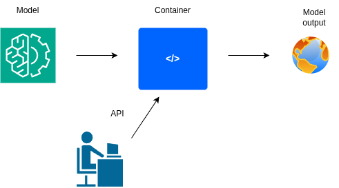

Perfect — here’s your **updated `ai_forecasting/README.md`**, now including a clear new section titled
📤 **Model Output Structure (Example: FourCastNet)**
that incorporates your detailed cfgrib explanation in a polished and professional format, consistent with your lab’s documentation style.

---

# 🌦️ GeoML-Lab API — Multi-Model Framework

## 🧭 General Description

All supported AI models — including **GraphCast**, **Pangu-Weather**, — are deployed as **individual containers**.
Each container exposes a consistent **FastAPI interface** for inference, health checks, and NetCDF file handling, enabling side-by-side benchmarking and interoperability.

The system architecture is designed for:

* **Modularity:** Swap models without changing the API interface
* **Reproducibility:** Containerized environments ensure consistent dependencies
* **Scalability:** Ready for local, cluster, or cloud-based deployment
* **Transparency:** Each model can be independently validated against ERA5 or observational datasets

---

## 🔁 API Workflow Overview

Each container follows the same pipeline:

1. **Input ingestion** — User uploads a NetCDF file (ERA5 or observational data).
2. **Model selection** — The request specifies the AI model (e.g., `GraphCast`, `Pangu-Weather`).
3. **Inference execution** — The model predicts future atmospheric variables.
4. **Output handling** — Results are returned as NetCDF files, ready for visualization or evaluation.

<p align="center">  
  
</p>

---

## ⚙️ Comparative Forecasting of Extreme Weather: AI Models

This project focuses on the **evaluation and application of advanced AI models** for forecasting **extreme weather**, with an emphasis on **severe precipitation** and **medium-range (1–15 day)** forecasts.
The models will be compared against each other to assess their skill in predicting rare, high-impact phenomena using **ERA5 reanalysis data**.

Ultimately, the project aims to:

* Measure **accuracy and reliability** under real-world extreme conditions
* Investigate **model bias** for high quantiles (e.g., 95th–99th percentile precipitation)
* Enable **integration into early-warning systems** for hydrometeorological hazards

---

### 📊 AI Models Under Evaluation

| Model                             |  Input Data               | Forecast Range               | Reference      |
| --------------------------------- | ------------------------- | ---------------------------- | -------------- |
| **FoureCastNet**                  |  ERA5 Reanalysis          | 6 h → 10 days  | [*Pathak et al., 2022*](https://doi.org/10.48550/arXiv.2202.11214) |
| **GraphCast**                     |  ERA5 Reanalysis          | 6 h → 10 days  | [*Lam et al., 2023*](https://doi.org/10.1126/science.adi2336)     |
| **FourCastNetV2**                 | ERA5 Reanalysis (0.25°)   | 6 h → 10 days        |   [*Pathak et al., 2022*](https://doi.org/10.48550/arXiv.2202.11214)  |
| **Pangu-Weather**                 | ERA5 Reanalysis (0.25°)   | 1 h → 7 days** | [Bi et al., 2023](https://doi.org/10.48550/arXiv.2211.02556)     |

Where the models produce the varibale in the table below.

| Variable | FourCastNet | GraphCast | FourCastNetV2 | PanguWeather |
|---------|-------------|-----------|----------------|---------------|
| tp      | ✓           | ✓         | —              | —             |
| t2m     | —           | ✓         | ✓              | ✓             |
| u10     | ✓           | ✓         | ✓              | ✓             |
| v10     | ✓           | ✓         | ✓              | ✓             |
| u100    | —           | —         | ✓              | —             |
| v100    | —           | —         | ✓              | —             |
| sp      | ✓           | —         | ✓              | —             |
| msl     | ✓           | ✓         | ✓              | ✓             |
| tcwv    | —           | —         | ✓              | —             |
| z (PL)  | ✓           | ✓         | ✓              | ✓             |
| t (PL)  | ✓           | ✓         | ✓              | ✓             |
| u (PL)  | ✓           | ✓         | ✓              | ✓             |
| v (PL)  | ✓           | ✓         | ✓              | ✓             |
| q       | —           | ✓         | —              | ✓             |
| w       | —           | ✓         | —              | —             |
| r       | ✓           | —         | ✓              | —             |
| lsm     | —           | ✓         | —              | —             |
| z (surf)| —           | ✓         | —              | —             |


> **Grid/Area used in this work:** 0.25° × 0.25°, global (N: 90°, W: 0°, S: −90°, E: 359.75°); product type: *reanalysis*.
> Note: ERA5 reanalysis, accumulation variables represent the amount accumulated over the last hour, ending at the timestamp selected
> Note: FoureCastNet and GraphCast accumulation variables predicts the 6-hourly accumulated total precipitation (rather than the 1 hourprecipitation in the raw ERA5 data).

---

## 📤 Model Output Structure of FourCastNet

When FourCastNet generates a forecast, the output is written as a **GRIB file**.
When opened with `cfgrib`, you’ll see multiple **dataset groups**, each representing a different atmospheric level or variable type.
Here’s how to interpret it:

---

### 🧩 What are “Dataset groups”?

Each section like:

```
=== Dataset group N ===
<xarray.Dataset> ...
```

is a separate `xarray.Dataset` with:

* its own **variables**
* its own **level type** (surface, 2 m, 10 m, pressure levels, etc.)
* consistent dimensions within that group.

`cfgrib.open_datasets(path)` returns all of them as a **list** — one per group.


---

### ⚙️ How to Access Specific Variables

#### Option 1 — Using `open_datasets`

```python
import cfgrib
datasets = cfgrib.open_datasets("fourcastnet_output.grib")
ds_tp = datasets[10]  # precipitation group
tp = ds_tp["tp"]
```

#### Option 2 — Using `filter_by_keys`

```python
import xarray as xr
ds_tp = xr.open_dataset(
    "fourcastnet_output.grib",
    engine="cfgrib",
    backend_kwargs={"filter_by_keys": {"shortName": "tp"}}
)
tp = ds_tp["tp"]
```

---

### 💡 Practical Notes

* You **don’t** need to open all groups at once — select only what you need (`tp`, `t2m`, etc.).
* Each group corresponds to specific GRIB metadata: `shortName`, `typeOfLevel`, `level`.
* Use `valid_time` to align forecasts with ERA5 truth for verification.
* Precipitation (`tp`) is typically **accumulated** over the forecast step — make sure to differentiate between **incremental** and **cumulative** totals before evaluation.

---
Below is a clean, structured explanation **just like the one you wrote for FourCastNet**, but now fully adapted to **GraphCast**.
Use this directly in your README.

---

# 📦 GraphCast Output Structure — Understanding the GRIB Dataset Groups

When GraphCast generates a forecast, the output is stored as a **multi-group GRIB file**.
When opened with `cfgrib`, this GRIB file expands into several **dataset groups**, each representing a specific meteorological variable class or atmospheric level type.

This section explains **exactly what each dataset group contains**, how to read them, and how to access variables such as precipitation.

---

## 🧩 What Are “Dataset Groups”?

`cfgrib.open_datasets(path)` returns a **list of multiple `xarray.Dataset` objects**.

Each dataset group:

* corresponds to a specific **GRIB definition** (e.g., `shortName`, `typeOfLevel`, pressure level),
* contains one or more **related variables**,
* has consistent **dimensions** (e.g., `(step, latitude, longitude)` or `(time, step, lat, lon)`).

GraphCast produces both **multi-step forecasts** and some **static fields**, and these are organized into 6 groups.

---

# 🗂️ Summary of GraphCast Dataset Groups

| Group | Variables                    | Level Type                | Notes                                                                                                          |
| ----- | ---------------------------- | ------------------------- | -------------------------------------------------------------------------------------------------------------- |
| **0** | `u10`, `v10`                 | heightAboveGround = 10m   | 10-meter wind components (surface winds).                                                                      |
| **1** | `t2m`                        | heightAboveGround = 2m    | Near-surface air temperature.                                                                                  |
| **2** | `z`, `t`, `u`, `v`, `q`, `w` | isobaricInhPa (13 levels) | Full 3D atmosphere: geopotential, temperature, wind, humidity, vertical velocity.                              |
| **3** | `msl`                        | meanSea                   | Mean sea-level pressure.                                                                                       |
| **4** | `z`, `lsm`                   | surface (static fields)   | Orography and land–sea mask (invariant fields).                                                                |
| **5** | `tp`                         | surface (multi-time)      | **Total precipitation**, the most important field for extreme-precip analysis.<br>→ **All TP data live here.** |

---

# 🧠 Details for Each Group

### **Group 0 – 10 m wind**

```text
Dimensions: (step, latitude, longitude)
Variables: u10, v10
```

Surface wind speeds at 5 forecast steps (0h, 6h, 12h, 18h, 24h).

---

### **Group 1 – 2 m temperature (t2m)**

```text
Dimensions: (step, latitude, longitude)
Variables: t2m
```

---

### **Group 2 – Pressure-level atmospheric fields**

```text
Dimensions: (step, isobaricInhPa, latitude, longitude)
Variables: z, t, u, v, q, w
Levels: 1000 → 50 hPa
```

This is the full GraphCast 3D atmospheric state:

* geopotential height
* temperature
* wind vector
* humidity
* vertical velocity

---

### **Group 3 – Mean Sea Level Pressure (msl)**

```text
Dimensions: (step, latitude, longitude)
Variables: msl
```

Useful for cyclone and synoptic-scale analysis.

---

### **Group 4 – Static fields**

```text
Dimensions: (latitude, longitude)
Variables: z, lsm
```

These fields **do not vary with forecast step or time**.

---

### **Group 5 – Total Precipitation (tp)**

📌 **This is the dataset group required for precipitation extreme evaluation.**

```text
Dimensions: (time: 2, step: 5, latitude, longitude)
Variables: tp
Coordinates:
    time:   [init_time_0, init_time_1]
    step:   [0h, 6h, 12h, 18h, 24h]
    valid_time(time, step)
```

Important notes:

* GraphCast stores *two* initializations in each GRIB file.
* Each initialization provides a **sequence of forecast steps**.
* Valid forecast times = `time + step`.
* To evaluate a specific extreme event, we select the `(time_idx)` whose `valid_time` matches our **target datetime**.

---

# 🔍 Accessing Precipitation from GraphCast

### Load all groups:

```python
datasets = cfgrib.open_datasets("graphcast_output.grib")
```

### Select the precipitation dataset (Group 5):

```python
ds_tp = datasets[5]
tp = ds_tp["tp"]                      # dims: (time, step, lat, lon)
valid_time = ds_tp["valid_time"]      # dims: (time, step)
```

### Find the forecast that matches a target datetime:

```python
import numpy as np

target = np.datetime64("1970-01-02T00:00")

# locate matching (time, step)
idx = np.argwhere(valid_time.values == target)
time_idx, step_idx = idx[0]

# full forecast for that initialization
tp_selected = tp.isel(time=time_idx)           # dims: (step, lat, lon)
vt_selected = valid_time.isel(time=time_idx)   # dims: (step,)
```

Now `tp_selected` has the same structure as FourCastNet’s `(step, lat, lon)` TP forecast.

---

# ✔️ Summary

GraphCast GRIB files contain:

* **surface variables** (t2m, u10, v10)
* **pressure-level 3D data** (temperature, humidity, winds)
* **static fields** (orography, land-sea mask)
* **precipitation** stored in a special multi-init dataset (Group 5)

---

## 📘 Detailed Model Documentation

Full technical details—including **environment setup**, **inference examples**, **evaluation metrics**, and **benchmark scripts**—are provided in the documentation:

👉 [**AI Model Guide**](https://github.com/vasileios27/GeoML-Lab/blob/main/ai_forecasting/AI_Model_Guide.md)

That document explains:

* Model-specific environment variables and Docker build instructions
* Data preprocessing using **ERA5**
* Model inference endpoints and expected I/O formats
* Recommended **extreme-aware metrics**: MCC, CSI, ROC, BSS, and RPSS

---

## 🧠 Notes

* All models operate via **FastAPI microservices** with consistent endpoints (`/echo`, `/healthz`).
* **NetCDF (.nc)** remains the standard format for all input and output data.
* Containers can run **independently or in parallel**, allowing distributed benchmarking.
* Each container can be launched with:

  ```bash
  docker run --rm -p 8000:8000 geolab/<model-name>
  ```
* Results can be aggregated and compared through the common evaluation pipeline in `AI_Model_Guide.md`.

---

## 📄 License

© 2025 Vasileios Vatellis — **GeoML-Lab**
Developed as part of the **GeoML-Lab initiative** for advancing AI-driven Earth observation and medium-range extreme weather forecasting.

---

Would you like me to now add a **“Model Output Conversion”** subsection explaining how to convert those GRIB outputs (e.g., from FourCastNet) into **NetCDF** format for easier plotting and cross-model comparison?
