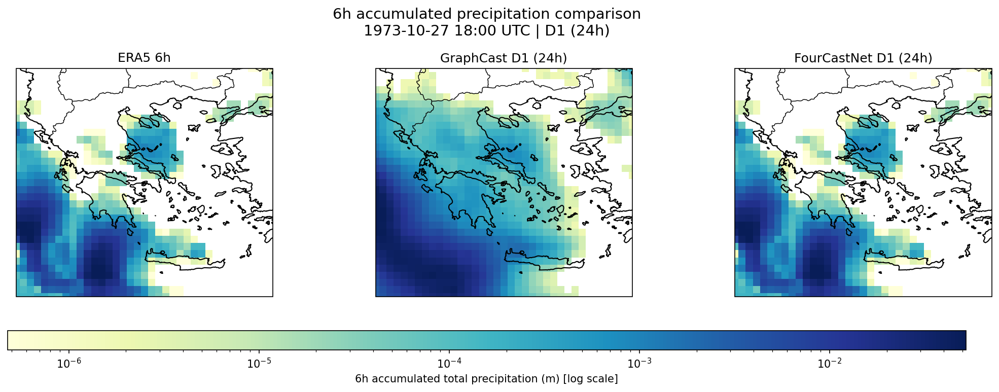
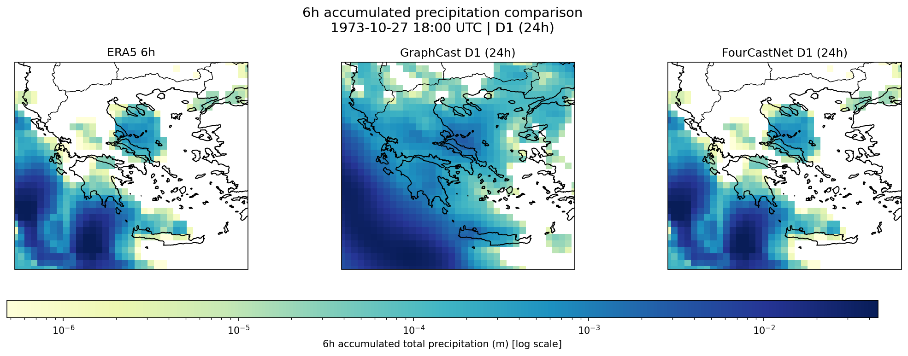
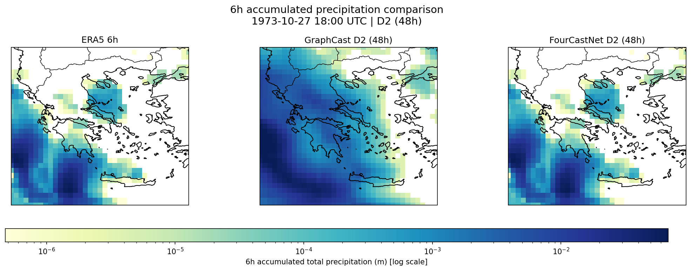
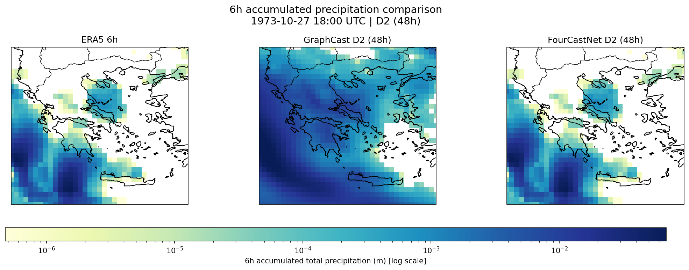
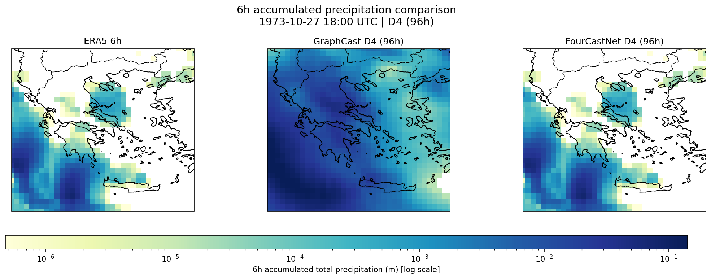
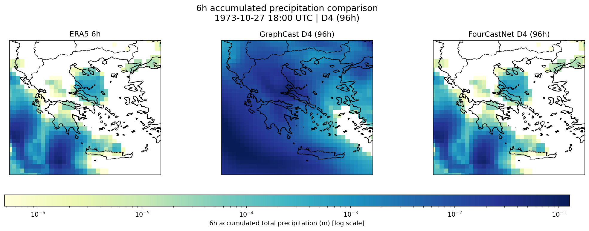
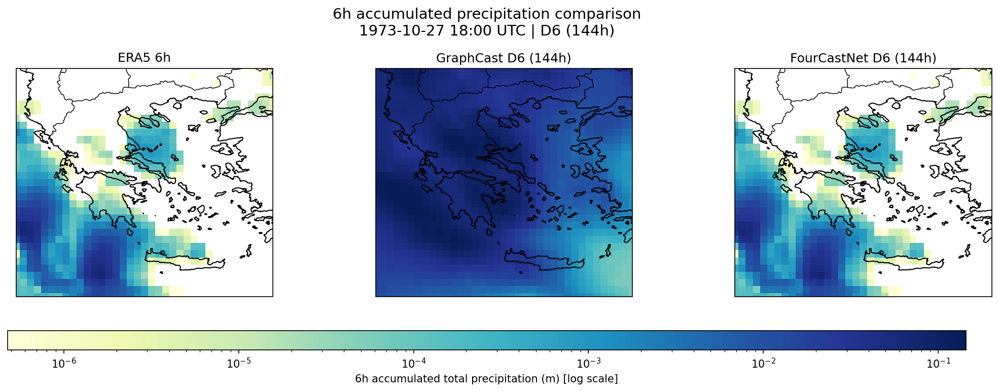
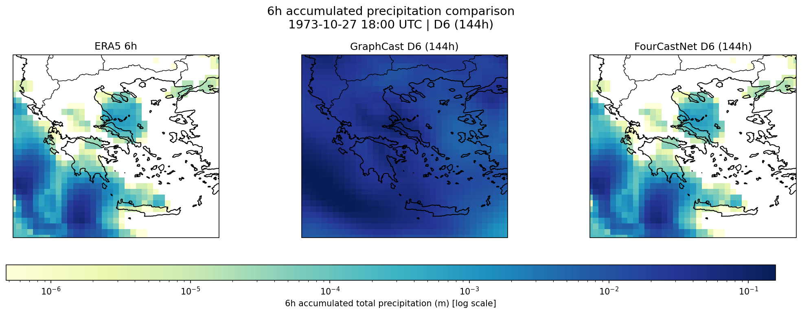
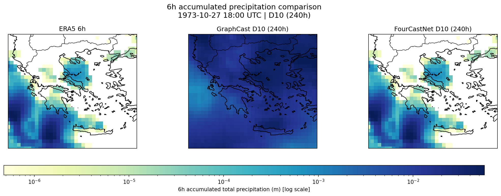
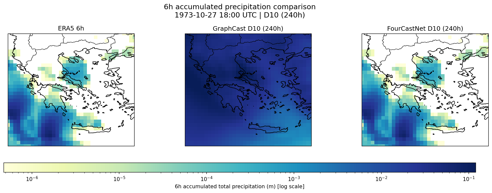

# 📄 **README — Extreme Precipitation Evaluation Report**

### *Case Study: 2023-12-21 00:00 UTC*

### *Models: GraphCast vs FourCastNet*

---

## 1. Overview

This report evaluates the ability of two AI-based global weather forecasting models:

* **GraphCast**
* **FourCastNet**

to predict an extreme precipitation event affecting Greece.

**Verification time:**
📅 **2023-12-21 00:00 UTC**

**Forecast lead times evaluated:**

| Lead day | Hours |
| -------- | ----- |
| D1       | 24h   |
| D2       | 48h   |
| D4       | 96h   |
| D6       | 144h  |
| D10      | 240h  |

ERA5 6-hour accumulated precipitation is used as the ground truth.
## 2. Methods Summary

* Models produce accumulated precipitation fields (`tp`)
* Regridded → **ERA5 Greece domain**
* Matched by valid_time
* Metrics computed:

  * Bias
  * RMSE
  * Spatial Correlation
  * CSI (Critical Success Index)
  * POD (Probability of Detection)
  * FAR (False Alarm Ratio)
  * Peak intensity ratio
  * Peak displacement distance (km)
  * Center-of-mass displacement (km)

> *Definitions and formulas for all metrics are provided in **Section 8 (Verification Metrics Explained)**.*
---

## 3. ERA5 Ground Truth

### ERA5 6-hour accumulated precipitation.
 

### ERA5 1-hour accumulated precipitation.

---

---

# 4. FourCastNet Forecast Evaluation (Filled Metrics)

All the data below, are the averages 
## 🔵 **4.1 Lead Time D1 (24h)**
Example plot for one event
**Figure FourCastNet D1 (24h) forecast vs ERA5**

**Figure GraphCast D1 (24h) forecast vs ERA5**

### **Metrics — D1**

=== FOURCASTNET vs GRAPHCAST — D1 Metrics Average values ===

| Metric          | FourCastNet   | GraphCast   |
|:----------------|:--------------|:------------|
| Hits            | 8             | 8           |
| Misses          | 7             | 7           |
| False Alarms    | 78            | 61          |
| Bias (m)        | 0.00636       | 0.00569     |
| RMSE            | 0.0127        | 0.0117      |
| Correlation     | 0.673         | 0.638       |
| CSI             | 0.109         | 0.114       |
| POD             | 0.536         | 0.509       |
| FAR             | 0.858         | 0.845       |
| Peak Ratio      | 1.30          | 1.03        |
| Peak Shift (km) | 178.0 km      | 168.1 km    |

---

## 🔵 **4.2 Lead Time D2 (48h)**

**Figure FourCastNet D2 (48h) forecast vs ERA5**

**Figure GraphCast D2 (48h) forecast vs ERA5**

### **Metrics — D2**

=== FOURCASTNET vs GRAPHCAST — D2 Metrics ===
| Metric          | FourCastNet   | GraphCast   |
|:----------------|:--------------|:------------|
| Hits            | 9             | 9           |
| Misses          | 7             | 6           |
| False Alarms    | 119           | 100         |
| Bias (m)        | 0.00899       | 0.00812     |
| RMSE            | 0.0174        | 0.0162      |
| Correlation     | 0.522         | 0.528       |
| CSI             | 0.084         | 0.096       |
| POD             | 0.545         | 0.583       |
| FAR             | 0.876         | 0.882       |
| Peak Ratio      | 1.66          | 1.41        |
| Peak Shift (km) | 258.0 km      | 271.4 km    |

---

## 🔵 **4.3 Lead Time D4 (96h)**

**Figure FourCastNet D4 (96h) forecast vs ERA5**

**Figure GraphCast D4 (96h) forecast vs ERA5**

### **Metrics — D4**

=== FOURCASTNET vs GRAPHCAST — D4 Metrics ===

| Metric          | FourCastNet   | GraphCast   |
|:----------------|:--------------|:------------|
| Hits            | 8             | 8           |
| Misses          | 8             | 8           |
| False Alarms    | 158           | 151         |
| Bias (m)        | 0.01325       | 0.01338     |
| RMSE            | 0.0234        | 0.0225      |
| Correlation     | 0.400         | 0.389       |
| CSI             | 0.061         | 0.052       |
| POD             | 0.483         | 0.451       |
| FAR             | 0.930         | 0.926       |
| Peak Ratio      | 2.07          | 1.67        |
| Peak Shift (km) | 322.2 km      | 317.9 km    |

---

## 🔵 **4.4 Lead Time D6 (144h)**

**Figure FourCastNet D6 (144h) forecast vs ERA5**

**Figure GraphCast D6 (144h) forecast vs ERA5**

### **Metrics — D6**
=== 🔍 FOURCASTNET vs GRAPHCAST — D6 Metrics ===

| Metric          | FourCastNet   | GraphCast   |
|:----------------|:--------------|:------------|
| Hits            | 6             | 6           |
| Misses          | 10            | 9           |
| False Alarms    | 219           | 207         |
| Bias (m)        | 0.01715       | 0.01681     |
| RMSE            | 0.0276        | 0.0269      |
| Correlation     | 0.207         | 0.232       |
| CSI             | 0.033         | 0.025       |
| POD             | 0.354         | 0.366       |
| FAR             | 0.952         | 0.969       |
| Peak Ratio      | 1.94          | 1.78        |
| Peak Shift (km) | 432.0 km      | 368.4 km    |
---

## 🔵 **4.5 Lead Time D10 (240h)**

**Figure FourCastNet D10 (240h) forecast vs ERA5**

**Figure GraphCast D10 (240h) forecast vs ERA5**

### **Metrics — D10**
=== FOURCASTNET vs GRAPHCAST — D10 Metrics ===

| Metric          | FourCastNet   | GraphCast   |
|:----------------|:--------------|:------------|
| Hits            | 4             | 5           |
| Misses          | 12            | 11          |
| False Alarms    | 324           | 315         |
| Bias (m)        | 0.02531       | 0.02372     |
| RMSE            | 0.0389        | 0.0353      |
| Correlation     | -0.034        | 0.040       |
| CSI             | 0.008         | 0.011       |
| POD             | 0.191         | 0.273       |
| FAR             | 0.991         | 0.989       |
| Peak Ratio      | 2.77          | 2.31        |
| Peak Shift (km) | 543.7 km      | 482.0 km    |
---

**Figure FourCastNet D10 (240h) forecast vs ERA5**

---

# 7. Summary & Conclusions

# **8. Verification Metrics Explained**

This section defines all metrics used in this evaluation.

* (F_i): forecast precipitation at grid point (i)
* (O_i): observed (ERA5) precipitation at grid point (i)
* (T_i): extreme-event threshold (local 95th percentile)

Extreme-event binary fields:

* Forecast extreme: $(E^F_i = 1) \quad \text{if} \quad (F_i > T_i), \quad \text{else} \quad 0$
* Observed extreme: $(E^O_i = 1) \quad \text{if} \quad (O_i > T_i), \quad \text{else} \quad 0$

Event counts:

* Hits (H): forecast = 1 and observed = 1
* Misses (M): forecast = 0 but observed = 1
* False alarms (F): forecast = 1 but observed = 0

All metrics are computed over the ERA5 Greece evaluation grid.

---

## **8.1 Bias**

$$\text{Bias} = \frac{1}{N} \sum_{i=1}^N (F_i - O_i)$$

Bias measures the *average error* of the forecast.

* Positive → overestimation
* Negative → underestimation

---

## **8.2 RMSE (Root Mean Square Error)**

$$\text{RMSE} = \sqrt{ \frac{1}{N} \sum_{i=1}^{N} (F_i - O_i)^2 }$$

Represents the *overall error magnitude*, heavily penalizing large discrepancies.
Lower RMSE indicates a forecast field closer to the observation.

---

## **8.3 Spatial Correlation**

$$
\text{Corr} =
\frac{
\sum (F_i - \overline{F})(O_i - \overline{O})
}{
\sqrt{\sum (F_i - \overline{F})^2}
\sqrt{\sum (O_i - \overline{O})^2}
}
$$

Measures similarity of the **spatial patterns**.

* 1 → perfect pattern match
* 0 → unrelated patterns
* –1 → opposite patterns

---

## **8.4 CSI — Critical Success Index**

$$\text{CSI} = \frac{H}{H + M + F}$$

Evaluates how well extreme events were detected.
Penalizes both misses and false alarms.
Higher CSI = better detection skill.

---

## **8.5 POD — Probability of Detection**

$$
\text{POD} = \frac{H}{H + M}
$$

Measures how many observed extremes were successfully predicted.

* POD = 1 → all extremes detected
* Does *not* penalize false alarms

---

## **8.6 FAR — False Alarm Ratio**

$$
\text{FAR} = \frac{F}{H + F}
$$

Fraction of predicted extremes that did *not* occur.
Lower FAR = more reliable forecasting of extremes.

---

## **8.7 Peak Intensity Ratio**

Let:

* $(O_{\max} = \max(O_i))$ 
* $(F_{\max} = \max(F_i))$ 

$$
\text{Peak Ratio} = \frac{F_{\max}}{O_{\max}}
$$

Measures how well the model captures **maximum rainfall intensity**.

---

## **8.8 Peak Displacement Distance (km)**

Let:

* Forecast peak location → $((\phi_F^{\max},\quad \lambda_F^{\max}))$
* Observed peak location → $((\phi_O^{\max},\quad \lambda_O^{\max}))$

Distance:

$$
d_{\text{peak}} = \text{haversine}(\phi_O^{\max},\lambda_O^{\max},\phi_F^{\max},\lambda_F^{\max})
$$

Captures how far the model misplaced the **center of the maximum rainfall**.

---

## **8.9 Center-of-Mass Displacement (km)**

ERA5 centroid:

$$
\phi_O^{\text{cm}} = \frac{\sum O_i \phi_i}{\sum O_i}, \qquad
\lambda_O^{\text{cm}} = \frac{\sum O_i \lambda_i}{\sum O_i}
$$

Forecast centroid:

$$
\phi_F^{\text{cm}} = \frac{\sum F_i \phi_i}{\sum F_i}, \qquad
\lambda_F^{\text{cm}} = \frac{\sum F_i \lambda_i}{\sum F_i}
$$

Distance:

$$
d_{\text{cm}} = \text{haversine}(\phi_O^{\text{cm}},\lambda_O^{\text{cm}},\phi_F^{\text{cm}},\lambda_F^{\text{cm}})
$$

Measures how far the **entire precipitation system** was shifted.

---

