# 📄 **README — Extreme Precipitation Evaluation Report**

### *Case Study: 2023-12-21 00:00 UTC*

### *Models: GraphCast vs FourCastNet*

---

## 1. Overview

This report evaluates the ability of two AI-based global weather forecasting models:

* **GraphCast**
* **FourCastNet**

to predict an extreme precipitation event affecting Greece.

**Verification time:**
📅 **2023-12-21 00:00 UTC**

**Forecast lead times evaluated:**

| Lead day | Hours |
| -------- | ----- |
| D1       | 24h   |
| D2       | 48h   |
| D4       | 96h   |
| D6       | 144h  |
| D10      | 240h  |

ERA5 6-hour accumulated precipitation is used as the ground truth.
## 2. Methods Summary

* Models produce accumulated precipitation fields (`tp`)
* Regridded → **ERA5 Greece domain**
* Matched by valid_time
* Metrics computed:

  * Bias
  * RMSE
  * Spatial Correlation
  * CSI (Critical Success Index)
  * POD (Probability of Detection)
  * FAR (False Alarm Ratio)
  * Peak intensity ratio
  * Peak displacement distance (km)
  * Center-of-mass displacement (km)

> *Definitions and formulas for all metrics are provided in **Section 8 (Verification Metrics Explained)**.*
---

## 3. ERA5 Ground Truth

### ERA5 6-hour accumulated precipitation.
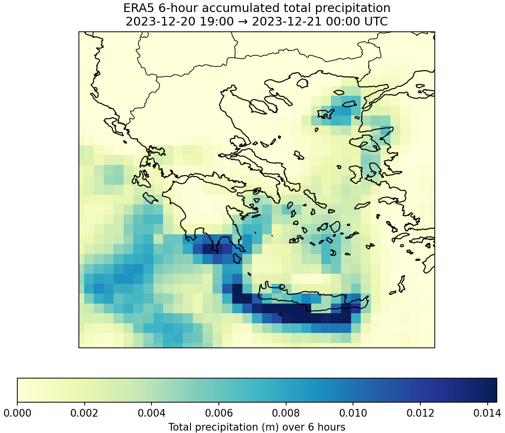 

### ERA5 1-hour accumulated precipitation.
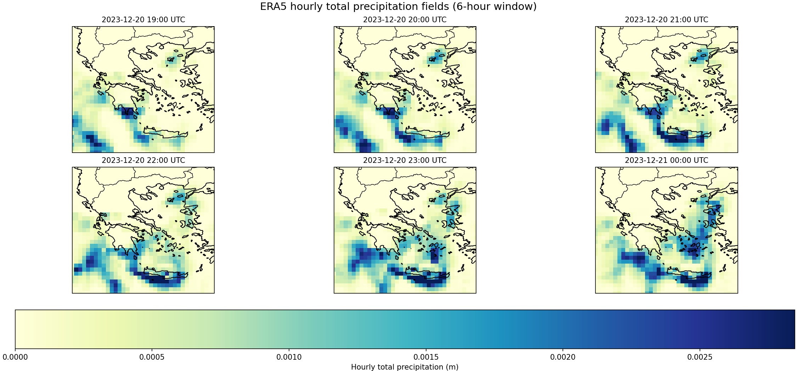
---

---

# 4. FourCastNet Forecast Evaluation (Filled Metrics)

## 🔵 **4.1 Lead Time D1 (24h)**

**Figure FourCastNet D1 (24h) forecast vs ERA5**

**Figure GraphCast D1 (24h) forecast vs ERA5**
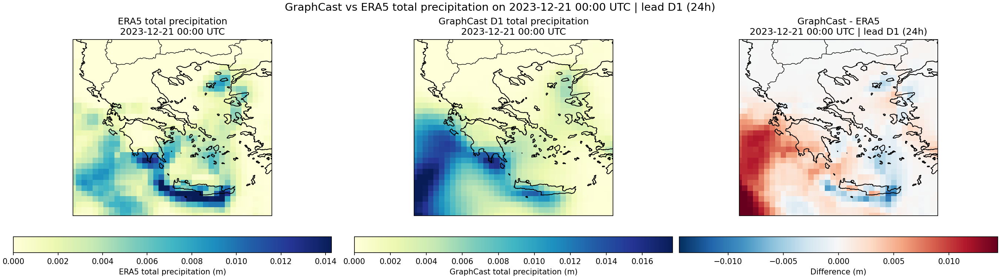

### **Metrics — D1**

=== FOURCASTNET vs GRAPHCAST — D1 Metrics ===

| Metric               | FourCastNet          | GraphCast            |
|----------------------|----------------------|----------------------|
| Hits                 | 720                  | 716                  |
| Misses               | 0                    | 4                    |
| False Alarms         | 230                  | 147                  |
| Bias (m)             | 0.00622              | 0.00140              |
| RMSE (m)             | 0.0090               | 0.0038               |
| Correlation          | 0.635                | 0.651                |
| CSI                  | 0.758                | 0.826                |
| POD                  | 1.000                | 0.994                |
| FAR                  | 0.242                | 0.170                |
| Peak Ratio           | 2.14                 | 0.98                 |
| Intensity Change (%) | 214.19%              | 98.18%               |
| Peak Shift (km)      | 316.8 km             | 526.6 km             |
| CoM Shift (km)       | 59.6 km              | 100.7 km             |

---

## 🔵 **4.2 Lead Time D2 (48h)**

**Figure FourCastNet D2 (48h) forecast vs ERA5**
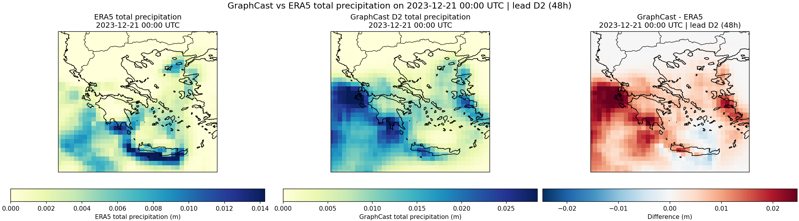
**Figure GraphCast D2 (48h) forecast vs ERA5**

### **Metrics — D2**

=== FOURCASTNET vs GRAPHCAST — D2 Metrics ===

| Metric               | FourCastNet          | GraphCast            |
|----------------------|----------------------|--------------------- |
| Hits                 | 720                  | 705                  |
| Misses               | 0                    | 15                   |
| False Alarms         | 228                  | 168                  |
| Bias (m)             | 0.00542              | 0.00165              |
| RMSE (m)             | 0.0086               | 0.0034               |
| Correlation          | 0.524                | 0.669                |
| CSI                  | 0.759                | 0.794                |
| POD                  | 1.000                | 0.979                |
| FAR                  | 0.241                | 0.192                |
| Peak Ratio           | 1.98                 | 0.91                 |
| Intensity Change (%) | 198.39%              | 90.95%               |
| Peak Shift (km)      | 524.6 km             | 393.9 km             |
| CoM Shift (km)       | 87.4 km              | 18.1 km              |

---

## 🔵 **4.3 Lead Time D4 (96h)**

**Figure FourCastNet D4 (96h) forecast vs ERA5**
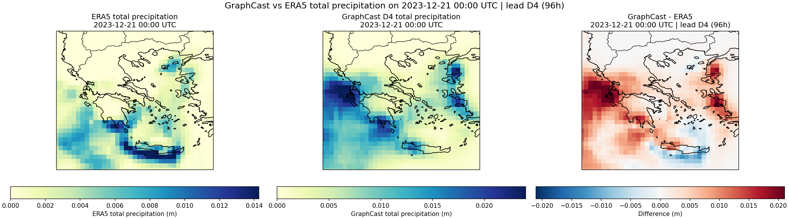
**Figure GraphCast D4 (96h) forecast vs ERA5**
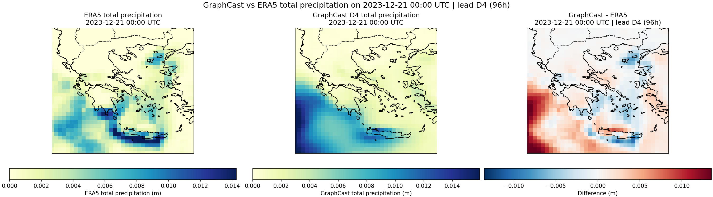

### **Metrics — D4**

=== FOURCASTNET vs GRAPHCAST — D4 Metrics ===

| Metric               | FourCastNet         | GraphCast          |
|----------------------|----------------------|---------------------|
| Hits                 | 720                  | 700                  |
| Misses               | 0                    | 20                   |
| False Alarms         | 269                  | 185                  |
| Bias (m)             | 0.00369              | 0.00104              |
| RMSE (m)             | 0.0066               | 0.0035               |
| Correlation          | 0.431                | 0.582                |
| CSI                  | 0.728                | 0.773                |
| POD                  | 1.000                | 0.972                |
| FAR                  | 0.272                | 0.209                |
| Peak Ratio           | 1.58                 | 0.94                 |
| Intensity Change (%) | 158.11%              | 93.54%               |
| Peak Shift (km)      | 543.7 km             | 546.5 km             |
| CoM Shift (km)       | 111.3 km             | 88.6 km              |

---

## 🔵 **4.4 Lead Time D6 (144h)**

**Figure FourCastNet D6 (144h) forecast vs ERA5**
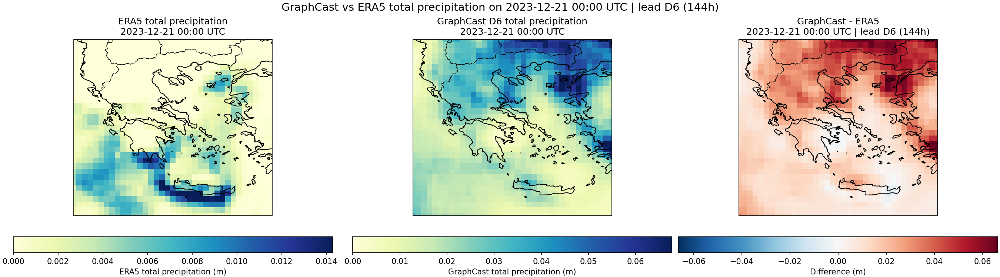
**Figure GraphCast D6 (144h) forecast vs ERA5**

### **Metrics — D6**
=== 🔍 FOURCASTNET vs GRAPHCAST — D6 Metrics ===

| Metric               | FourCastNet         | GraphCast          |
|----------------------|----------------------|---------------------|
| Hits                 | 720                  | 720                  |
| Misses               | 0                    | 0                    |
| False Alarms         | 501                  | 499                  |
| Bias (m)             | 0.02120              | 0.02029              |
| RMSE (m)             | 0.0267               | 0.0257               |
| Correlation          | -0.217               | -0.262               |
| CSI                  | 0.590                | 0.591                |
| POD                  | 1.000                | 1.000                |
| FAR                  | 0.410                | 0.409                |
| Peak Ratio           | 4.75                 | 3.81                 |
| Intensity Change (%) | 475.23%              | 380.94%              |
| Peak Shift (km)      | 590.4 km             | 594.1 km             |
| CoM Shift (km)       | 301.1 km             | 305.8 km             |
---

## 🔵 **4.5 Lead Time D10 (240h)**

**Figure FourCastNet D10 (240h) forecast vs ERA5**
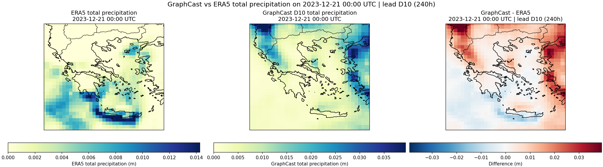
**Figure GraphCast D10 (240h) forecast vs ERA5**
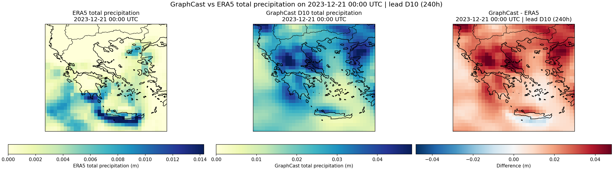

### **Metrics — D10**
=== FOURCASTNET vs GRAPHCAST — D1 Metrics ===

| Metric               | FourCastNet          | GraphCast            |
|----------------------|----------------------|----------------------|
| Hits                 | 720                  | 720                  |
| Misses               | 0                    | 0                    |
| False Alarms         | 501                  | 501                  |
| Bias (m)             | 0.00617              | 0.02074              |
| RMSE (m)             | 0.0121               | 0.0237               |
| Correlation          | -0.355               | -0.246               |
| CSI                  | 0.590                | 0.590                |
| POD                  | 1.000                | 1.000                |
| FAR                  | 0.410                | 0.410                |
| Peak Ratio           | 3.25                 | 3.06                 |
| Intensity Change (%) | 324.87%              | 305.90%              |
| Peak Shift (km)      | 871.6 km             | 566.8 km             |
| CoM Shift (km)       | 333.2 km             | 253.1 km             |
---

# 6. GraphCast vs FourCastNet — Lead-by-Lead Comparison

===  GraphCast vs FourCastNet — Pairwise Metrics (GC_vs_FC) ===

| Lead | mean_GC (m) | mean_FC (m) | Bias (GC−FC) (m) | RMSE(GC,FC) (m) | Corr(GC,FC) |
|------|-------------|-------------|------------------|-----------------|------------|
| D1   | 0.003667    | 0.008483    | -0.004816        | 0.006885        | 0.822      |
| D2   | 0.003914    | 0.007685    | -0.003772        | 0.007002        | 0.658      |
| D4   | 0.003309    | 0.005959    | -0.002650        | 0.005667        | 0.573      |
| D6   | 0.022562    | 0.023471    | -0.000908        | 0.009314        | 0.810      |
| D10  | 0.023005    | 0.008438    | 0.014568         | 0.017845        | 0.431      |

**Figure FourCastNet D10 (240h) forecast vs ERA5**
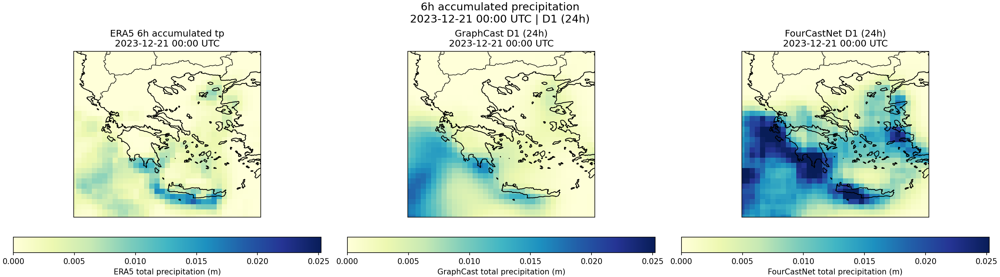
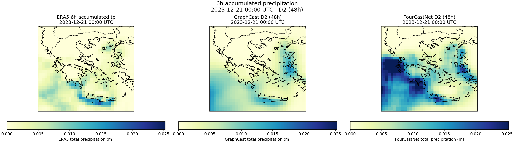
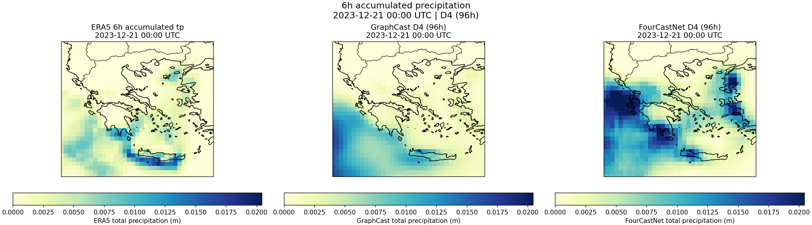
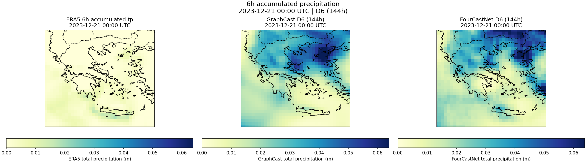
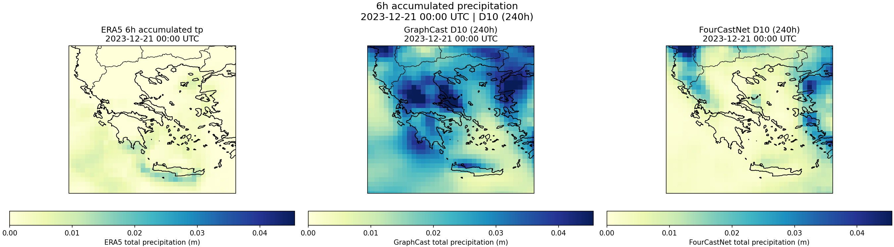
---

# 7. Summary & Conclusions

# **8. Verification Metrics Explained**

This section defines all metrics used in this evaluation.
Let the forecast and ERA5 observation fields be:

* (F_i): forecast precipitation at grid point (i)
* (O_i): observed (ERA5) precipitation at grid point (i)
* (T_i): extreme-event threshold (local 95th percentile)

Extreme-event binary fields:

* Forecast extreme: (E^F_i = 1) if (F_i > T_i), else 0
* Observed extreme: (E^O_i = 1) if (O_i > T_i), else 0

Event counts:

* Hits (H): forecast = 1 and observed = 1
* Misses (M): forecast = 0 but observed = 1
* False alarms (F): forecast = 1 but observed = 0

All metrics are computed over the ERA5 Greece evaluation grid.

---

## **8.1 Bias**

[
\text{Bias} = \frac{1}{N} \sum_{i=1}^N (F_i - O_i)
]

Bias measures the *average error* of the forecast.

* Positive → overestimation
* Negative → underestimation

---

## **8.2 RMSE (Root Mean Square Error)**

[
\text{RMSE} = \sqrt{ \frac{1}{N} \sum_{i=1}^{N} (F_i - O_i)^2 }
]

Represents the *overall error magnitude*, heavily penalizing large discrepancies.
Lower RMSE indicates a forecast field closer to the observation.

---

## **8.3 Spatial Correlation**

[
\text{Corr} =
\frac{
\sum (F_i - \overline{F})(O_i - \overline{O})
}{
\sqrt{\sum (F_i - \overline{F})^2}
\sqrt{\sum (O_i - \overline{O})^2}
}
]

Measures similarity of the **spatial patterns**.

* 1 → perfect pattern match
* 0 → unrelated patterns
* –1 → opposite patterns

---

## **8.4 CSI — Critical Success Index**

[
\text{CSI} = \frac{H}{H + M + F}
]

Evaluates how well extreme events were detected.
Penalizes both misses and false alarms.
Higher CSI = better detection skill.

---

## **8.5 POD — Probability of Detection**

[
\text{POD} = \frac{H}{H + M}
]

Measures how many observed extremes were successfully predicted.

* POD = 1 → all extremes detected
* Does *not* penalize false alarms

---

## **8.6 FAR — False Alarm Ratio**

[
\text{FAR} = \frac{F}{H + F}
]

Fraction of predicted extremes that did *not* occur.
Lower FAR = more reliable forecasting of extremes.

---

## **8.7 Peak Intensity Ratio**

Let:

* (O_{\max} = \max(O_i))
* (F_{\max} = \max(F_i))

[
\text{Peak Ratio} = \frac{F_{\max}}{O_{\max}}
]

Measures how well the model captures **maximum rainfall intensity**.

---

## **8.8 Peak Displacement Distance (km)**

Let:

* Forecast peak location → ((\phi_F^{\max}, \lambda_F^{\max}))
* Observed peak location → ((\phi_O^{\max}, \lambda_O^{\max}))

Distance:

[
d_{\text{peak}} = \text{haversine}(\phi_O^{\max},\lambda_O^{\max},\phi_F^{\max},\lambda_F^{\max})
]

Captures how far the model misplaced the **center of the maximum rainfall**.

---

## **8.9 Center-of-Mass Displacement (km)**

ERA5 centroid:

[
\phi_O^{\text{cm}} = \frac{\sum O_i \phi_i}{\sum O_i}, \qquad
\lambda_O^{\text{cm}} = \frac{\sum O_i \lambda_i}{\sum O_i}
]

Forecast centroid:

[
\phi_F^{\text{cm}} = \frac{\sum F_i \phi_i}{\sum F_i}, \qquad
\lambda_F^{\text{cm}} = \frac{\sum F_i \lambda_i}{\sum F_i}
]

Distance:

[
d_{\text{cm}} = \text{haversine}(\phi_O^{\text{cm}},\lambda_O^{\text{cm}},\phi_F^{\text{cm}},\lambda_F^{\text{cm}})
]

Measures how far the **entire precipitation system** was shifted.

---

# 🔚 **End of Metrics Appendix**

---

