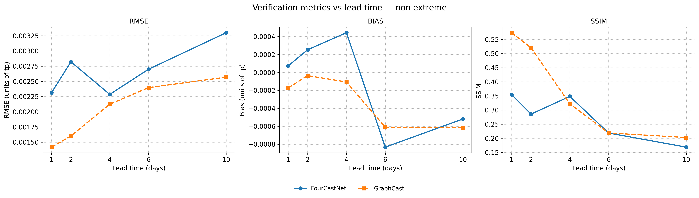
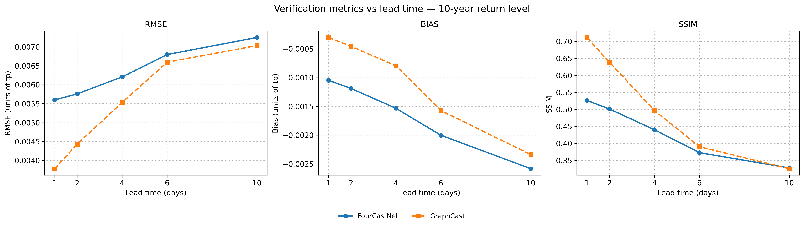
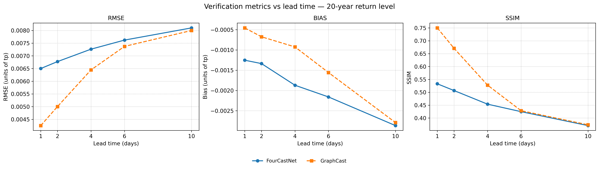
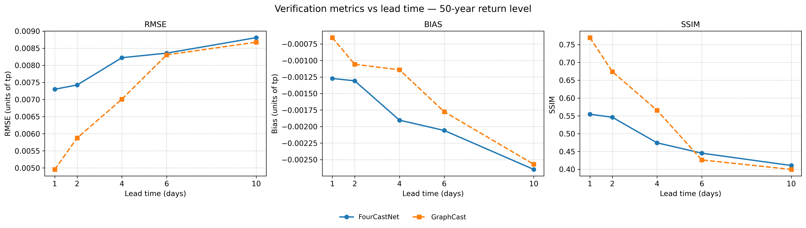
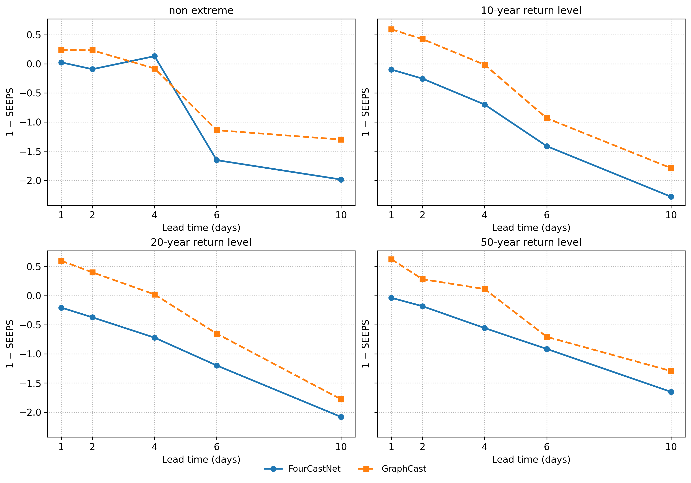

# 📊 Model Comparison Analysis: GraphCast vs FourCastNet

*Part of the GeoML-Lab Multi-Model Framework for Extreme Weather Forecasting*

---

## 🎯 Overview

This folder contains the systematic evaluation and comparison of two state-of-the-art data-driven global weather forecasting models — **GraphCast** and **FourCastNet** — with a focus on their ability to forecast **total precipitation (tp)** over Greece across multiple lead times and extreme-event return-period categories.

The analysis covers:
- Standard verification metrics (RMSE, Bias, SSIM) stratified by EVA-based return-period class
- Categorical skill via the SEEPS score
- Forecast-to-impact evaluation connecting model outputs to flood-impact classification

---

## 🤖 Models

### GraphCast
GraphCast ([Lam et al., 2023](https://doi.org/10.1126/science.adi2336)) is based on a **Graph Neural Network (GNN)** architecture that models the atmosphere as a graph of interconnected nodes, enabling efficient representation of spatial relationships across the globe. It produces global forecasts at **0.25° resolution**, predicting hundreds of atmospheric variables up to **10 days ahead** in under 60 seconds on a single Cloud TPU v4 device.

In extensive evaluations, GraphCast outperforms the ECMWF operational deterministic system (HRES) on approximately **90% of 1,380 verification targets**, spanning multiple variables, pressure levels, and lead times for the 10-day forecasting window.

| Variable group | Variables included |
|---|---|
| Atmospheric | `z`, `q`, `t`, `u`, `v`, `w` |
| Surface | `2t`, `10u`, `10v`, `msl`, `tp` |

### FourCastNet
FourCastNet ([Pathak et al., 2022](https://doi.org/10.48550/arXiv.2202.11214)) operates at **0.25° resolution** and uses the **Adaptive Fourier Neural Operator (AFNO)** architecture. It uses 20 atmospheric variables as inputs and demonstrated strong skill at short lead times, outperforming ECMWF IFS for forecasts up to approximately 48 hours for surface wind fields and total precipitation. A 100-member 24-hour forecast can be computed in 7 seconds using a single node with 4 A100 GPUs.

| Variable group | Variables included |
|---|---|
| Atmospheric | `z`, `t`, `u`, `v`, `RH` |
| Surface | `2t`, `10u`, `10v`, `msl`, `sp`, `mslp`, `tp` |
| Integrated | `TCWV` |

---

## 📐 Verification Methodology

The comparison is based on four standard precipitation verification metrics, evaluated across four event classes defined by the EVA-derived return-level thresholds (see [`extremes/README.md`](../extremes/README.md)):

| Event Class | Return Period | Annual Exceedance Probability |
|---|---|---|
| Non-extreme | — | — |
| Moderate extreme | 10-year | (1/20, 1/10] |
| Severe extreme | 20-year | (1/50, 1/20] |
| Most severe | 50-year | (0, 1/50] |

### Metrics

**RMSE** — Root Mean Square Error. Measures the average magnitude of the forecast error. Lower is better.

**Bias** — Systematic over- or under-estimation of precipitation. Values near zero indicate unbiased forecasts; negative bias indicates underestimation.

**SSIM** — Structural Similarity Index. Evaluates the spatial structure of the forecasted precipitation field relative to ERA5. Values closer to 1 indicate better spatial agreement.

**SEEPS** — Stable Equitable Error in Probability Space ([Rodwell et al., 2010](https://doi.org/10.1002/qj.649)). A climatology-aware categorical metric that accounts for the skewed distribution of precipitation (dry, light, heavy). Following the WeatherBench convention, the reported value is **(1 − SEEPS)**, which is positively oriented — higher values indicate better skill.

---

## 📈 Verification Results

### RMSE, Bias and SSIM

  
  
  
  

> *Verification metrics versus lead time for FourCastNet (blue) and GraphCast (orange), shown for four event classes: non-extreme (top), 10-year return level, 20-year return level, and 50-year return level (bottom). Left column: RMSE. Centre: Bias. Right: SSIM.*

**Key observations:**

- GraphCast achieves lower RMSE than FourCastNet across most lead times and return-period categories. Both models show increasing RMSE with lead time, consistent with the inherent growth of forecast uncertainty.
- Both models exhibit **negative bias**, indicating a tendency to underestimate extreme precipitation intensities. This underestimation is a known limitation of data-driven models that apply Gaussian normalisation to a non-Gaussian variable.
- SSIM degrades with increasing lead time for both models. GraphCast generally preserves spatial structure better, with isolated exceptions at the 50-year return level at 6-day lead time where FourCastNet shows slightly higher SSIM.
- Performance degrades as the **return period increases** and as the **lead time increases**, consistent with the increasing rarity and spatial localisation of more extreme events.

---

### SEEPS Skill Score

  

> *(1 − SEEPS) skill score versus lead time for FourCastNet (blue) and GraphCast (orange), shown for non-extreme, 10-year, 20-year, and 50-year return-level event classes.*

**Key observations:**

- GraphCast outperforms FourCastNet on SEEPS across all return-period categories and most lead times.
- For **non-extreme events**, FourCastNet shows slightly better SEEPS at 4-day lead time.
- Both models show rapidly degrading SEEPS with increasing lead time, particularly for the most extreme event categories. At 10-day lead time the skill score becomes negative for several categories, indicating performance below the climatological reference.
- The **10-year and 50-year return-level** panels show the clearest separation between the two models, with GraphCast maintaining positive skill scores at shorter lead times where FourCastNet has already deteriorated.

---

## 📁 Plot Files

Place the following plot files in `./plots/` to populate this document:

| File | Contents |
|---|---|
| `verification_metrics.png` | RMSE, Bias, SSIM vs lead time — 4 return-period rows × 3 metric columns |
| `seeps.png` | (1 − SEEPS) vs lead time — 4 return-period panels |

---

## 🧾 License

© 2025 Vasileios Vatellis — **GeoML-Lab Initiative**  
All results and figures are provided for research and non-commercial purposes.
