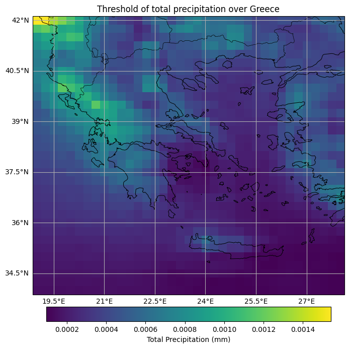

# ⚡ Extreme Event Definitions and Examples

*Part of the GeoML-Lab Multi-Model Framework for Extreme Weather Forecasting*

---

## 🌍 Purpose

This document describes **how GeoML-Lab defines and identifies extreme events** in weather and climate data.
These definitions form the foundation for:

* **Labeling events** used in model training and evaluation
* **Establishing thresholds** for classification and regression tasks
* **Comparing AI model performance** on rare, high-impact phenomena

---

## 📈 General Definition

An **extreme event** is defined as an atmospheric or hydrological phenomenon that **significantly deviates from the local climatological distribution**, typically beyond a specified percentile threshold.
In most analyses, GeoML-Lab adopts:

* **Upper-tail extremes:** 95th percentile (e.g., heavy rain, heatwaves, high wind)
* **Lower-tail extremes:** 1st–5th percentile (e.g., cold spells, low pressure anomalies)

All thresholds are computed over a **30-year reference climatology (e.g., 1991–2020)** using **ERA5 reanalysis** or compatible datasets.

---

## 🌧️ Categories of Extreme Events

| Type                      | Definition                                                    | Typical Threshold                                 | Relevant Variables   | ERA5 Codes    |
| ------------------------- | ------------------------------------------------------------- | ------------------------------------------------- | -------------------- | ------------- |
| **Extreme Precipitation** | Daily or hourly rainfall exceeding local 95th–99th percentile | >95th percentile of total precipitation (`tp`)    | `tp`, `cape`, `tcwv` | 228, 59       |
| **Heatwaves**             | ≥3 consecutive days above 90th percentile of max temperature  | 90th percentile of `t2m` or `tmax`                | `t2m`, `tmax`, `rh`  | 167, 201      |
| **Cold Spells**           | ≥3 consecutive days below 10th percentile of min temperature  | 10th percentile of `t2m` or `tmin`                | `t2m`, `tmin`        | 202           |
| **Wind Extremes**         | 10-m wind speed above 95th percentile                         | >95th percentile of `u10`, `v10`                  | `u10`, `v10`, `ws10` | 165, 166      |
| **Storms / Cyclones**     | Closed low-pressure systems with extreme wind/rain signatures | <5th percentile of sea-level pressure + high wind | `msl`, `u10`, `v10`  | 151, 165, 166 |
| **Compound Events**       | Simultaneous or sequential extremes (e.g., rain + wind)       | Joint exceedance of multiple variables            | Combined             | —             |

---

## ERA5 Threshold over Greece for total precipitation

<p align="center">  </p>

The figure above shows the threshold values of total precipitation (tp_q95_alltime) across Greece, calculated for each grid point. These thresholds serve as reference levels for identifying local extremes. During analysis, any grid cell exceeding its corresponding threshold will be marked as an extreme grid point. If more than 150 grid points are classified as extreme in a single time snapshot, that day will be defined as an extreme precipitation day.
## 🧠 Notes on Labeling for Machine Learning

* Events are **binary-labeled** as 1 (extreme) or 0 (non-extreme).
* Compound events may use **multi-label encoding** (e.g., `[rain, wind] = [1,1]`).
* For probabilistic models, labels are used to compute **Brier** and **ROC** scores.
* ERA5 grid-level thresholds are saved under `/data/thresholds/` for model input pipelines.

---

## 🗺️ Visual Examples

This section provides example maps and figures illustrating what GeoML-Lab classifies as “extreme.”
Place your images inside `/extremes/images/` and link them here.

| Event Type           | Example                                            | Description                                                                      |
| -------------------- | -------------------------------------------------- | -------------------------------------------------------------------------------- |
| **Extreme Rainfall** |  | ERA5 total precipitation anomaly exceeding 99th percentile during a flood event. |
| **Heatwave**         |          | Consecutive days of 2m temperature above 90th percentile.                        |
| **Windstorm**        |        | 10-m wind magnitude above 95th percentile (storm track highlighted).             |
| **Compound Event**   |      | Co-occurrence of heavy rain and strong wind.                                     |

---

## 📚 Regional Considerations

Thresholds may vary depending on climatic regions:

* **Northern Europe:** High wind and storm events dominate; use 95th wind percentile.
* **Mediterranean Basin:** Short-duration convective extremes; use 99th rainfall percentile.
* **Tropical zones:** Daily rainfall thresholds may be replaced by 3-hourly accumulation.

---

## 🔍 Research References

* **Olivetti & Messori (2024)** — *Advances and Prospects of Deep Learning for Medium-Range Extreme Weather Forecasting*
* **Materia et al. (2024)** — *AI for Climate Prediction of Extremes*
* **Zhang et al. (2023)** — *Global Classification of Extreme Precipitation from ERA5*
* **IPCC AR6 WG1 (2021)** — *Chapter 11: Weather and Climate Extreme Events*

---

## 📁 Folder Structure

```
extremes/
│
├── definitions.md        # You are here
├── images/
│   ├── extreme_rain.png
│   ├── heatwave.png
│   ├── windstorm.png
│   └── compound_event.png
└── thresholds/           # Optional: ERA5 percentile thresholds
```

---

## 🧩 Integration Notes

The thresholds and event masks defined here will be directly used in:

* **Model evaluation scripts** (`evaluation.ipynb`)
* **Training pipelines** for binary or probabilistic classification of extremes
* **Visualization dashboards** showing detected events versus observations

---

## 🧾 License

© 2025 Vasileios Vatellis — **GeoML-Lab Initiative**
All definitions and figures are provided for research and non-commercial purposes.

---

Would you like me to now generate a **simple diagram (`extreme_event_thresholds.png`)** that visually explains how ERA5 data → percentile threshold → extreme classification works (for inclusion under `/extremes/images/`)?
