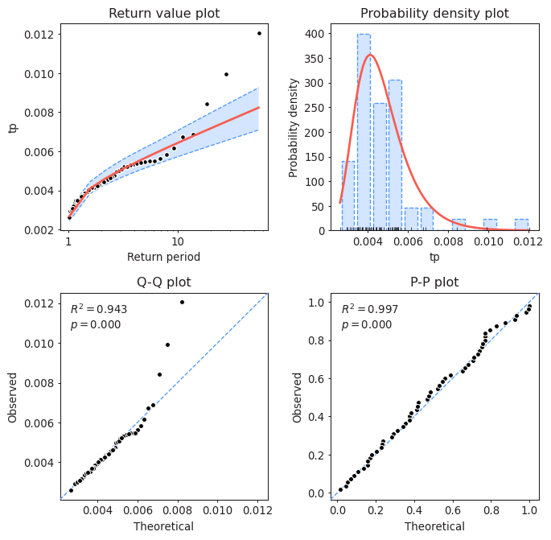
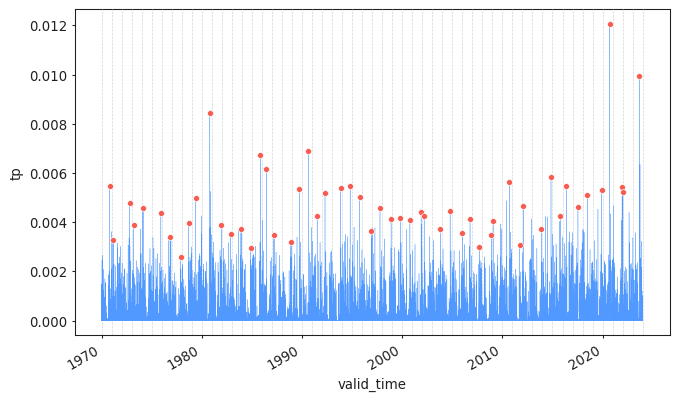
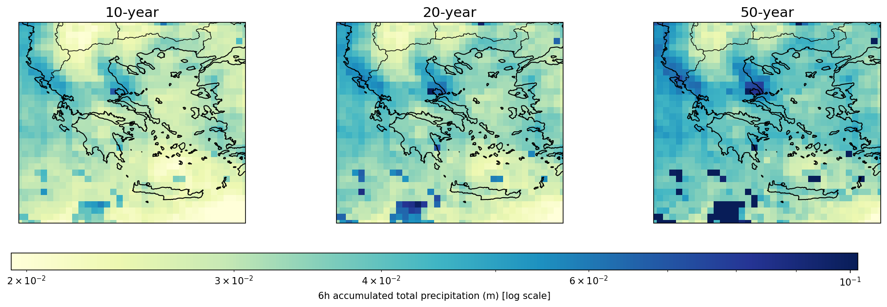

# ⚡ Extreme Event Definitions and Examples

*Part of the GeoML-Lab Multi-Model Framework for Extreme Weather Forecasting*

---

## 🌍 Purpose

This document describes **how GeoML-Lab defines extreme events** in weather and climate data.
These definitions form the foundation for:

* **Labeling events** used in model training and evaluation
* **Establishing thresholds** for classification and regression tasks
* **Comparing AI model performance** on rare, high-impact phenomena

---

## 📈 General Definition

An **extreme event** is defined as an atmospheric or hydrological phenomenon that **significantly deviates from the local climatological distribution**, typically beyond a specified percentile threshold. Thresholds are computed locally at each grid point to account for spatial heterogeneity across the study domain.

* **Upper-tail extremes:** typically above the 90th–99th percentile (e.g., heavy rain, heatwaves, high wind)
* **Lower-tail extremes:** typically below the 1st–5th percentile (e.g., cold spells, low-pressure anomalies)

For a rigorous statistical characterisation of rare events, GeoML-Lab uses **Extreme Value Analysis (EVA)**, which goes beyond simple percentile thresholds and estimates return levels associated with specific recurrence frequencies (e.g., 10-, 20-, and 50-year events).

### Definition Used in This Study

For precipitation-related extremes, the analysis focuses on **upper-tail events** defined using EVA applied to ERA5 total precipitation. Thresholds are derived from a long-term climatological period spanning **1970 to 2023**, ensuring that extremes are identified relative to local climatic conditions.

Specifically, the EVA uses **annual block maxima** extracted above the **90th percentile** of each grid-point time series, and fits a **Generalised Extreme Value (GEV) distribution** to those maxima. This enables the estimation of **return levels** associated with rare events — 10-, 20-, and 50-year return periods — along with diagnostic assessments of distributional fit. The methodology is implemented using the [`pyextremes`](https://georgebv.github.io/pyextremes/) Python package.

---

## 🔢 EVA Methodology: Grid-Point Threshold Estimation

In this section we perform **Extreme Value Analysis (EVA)** on ERA5 total precipitation using the [`pyextremes`](https://georgebv.github.io/pyextremes/) Python package.

`pyextremes` performs EVA by extracting extreme events from a time series using either Block Maxima (GEV) or Peaks-Over-Threshold (GPD) methods, fitting the appropriate extreme-value distribution using maximum likelihood, and computing statistically meaningful metrics such as return levels and return periods. This provides a rigorous, theoretically grounded way to quantify rare and high-impact climate events like extreme precipitation.

### Algorithm: Grid-Point EVA Threshold Estimation

The procedure below summarises how EVA thresholds are computed independently at each grid point of the ERA5 domain. The resulting threshold grids are saved as NetCDF files and used downstream for extreme-event detection.

```
Algorithm: Grid-Point EVA Threshold Estimation

Input:  Gridded precipitation dataset tp(t, φ, λ)
        with time coordinate t and spatial grid (φ, λ)

for all latitudes φ in grid do
    for all longitudes λ in grid do

        1. Extract 1D time series  s(t) ← tp(t, φ, λ)
        2. Convert t to a datetime index; remove missing values from s(t)

        3. Initialise EVA model with s(t)
        4. Extract extremes using Block Maxima:
              - extremes type : upper tail, 90th-percentile threshold
              - block size    : annual (≈ 1 year)

        5. Fit a GEV distribution to the extracted block maxima
        6. Compute return levels for return periods [10, 20, 50] years
              at 95 % confidence interval

    end for
end for

Output: Three threshold grids R_f(φ, λ)  [f ∈ {10 yr, 20 yr, 50 yr}]
        saved as NetCDF files
```

The full implementation is in [`threshold_EVA.py`](./threshold_EVA.py).

### Single Grid-Point Example

We demonstrate the analysis for a single representative grid point over Greece:

1. Extract a **single grid-point time series**
2. Fit a **GEV model** using **Block Maxima (BM)** with annual maxima
3. Compute **10, 20, and 50-year return levels**
4. Generate **diagnostic plots** and a **return value plot**

#### Diagnostic plots (PDF, Q–Q, P–P)



* **Probability density plot**: fitted vs empirical distribution
* **Q–Q plot**: theoretical vs observed quantiles
* **P–P plot**: theoretical vs observed probabilities

Frequency distribution for the selected grid point:



---

## 🌧️ Categories of Extreme Events

| Type | Definition | Threshold (this study) | Relevant Variables |
| ---- | ---------- | ---------------------- | ------------------ |
| **Extreme Precipitation** | The accumulated liquid and frozen water, comprising rain and snow, that falls to the Earth's surface | EVA-derived 10/20/50-year return level of 6-hour accumulated `tp` | `tp`, `cape`, `tcwv` |

👉 [**tp parameter detail**](https://codes.ecmwf.int/grib/param-db/228)
> Note: In ERA5 reanalysis, accumulation variables represent the amount accumulated over the last hour, ending at the timestamp selected.

---

## 🗺️ EVA Threshold Maps over Greece

The EVA produces three spatially explicit threshold grids — one per return period — stored as NetCDF files and visualised below. Each grid contains the locally estimated return level at every ERA5 grid point over the Greek domain (34°–42° N, 19°–28° E, 33×37 grid).

### Threshold Files

<p align="center">
<table>
  <thead>
    <tr><th align="center">Return Period</th><th align="center">NetCDF File</th></tr>
  </thead>
  <tbody>
    <tr><td align="center">10-year</td><td align="center"><a href="./GR_tp_threshold_rl10_BM.nc"><code>GR_tp_threshold_rl10_BM.nc</code></a></td></tr>
    <tr><td align="center">20-year</td><td align="center"><a href="./GR_tp_threshold_rl20_BM.nc"><code>GR_tp_threshold_rl20_BM.nc</code></a></td></tr>
    <tr><td align="center">50-year</td><td align="center"><a href="./GR_tp_threshold_rl50_BM.nc"><code>GR_tp_threshold_rl50_BM.nc</code></a></td></tr>
  </tbody>
</table>
</p>


Each file contains the GEV-fitted return level for 6-hour accumulated total precipitation (units: m), computed using annual block maxima over 1970–2023. These grids are used as spatial masks to identify forecasted or observed extreme precipitation pixels.

### Threshold Masks (10 / 20 / 50-year return levels)

<p align="center">
  
</p>

> *Left: 10-year return level. Centre: 20-year return level. Right: 50-year return level.*  
> Colour scale shows 6-hour accumulated total precipitation (m, log scale).

Higher return-period thresholds are more spatially concentrated in the orographically complex western and northern regions of Greece, reflecting the stronger influence of terrain on extreme precipitation.

---

## 📅 EVA-Derived Extreme Event Catalogue

Extreme time stamps are grouped by estimated return period. A time stamp is classified as extreme when more than 10 grid points across the Greek domain simultaneously exceed their locally defined EVA return-level threshold.

### ≥ 50-Year Return Level Events

The most severe category — events exceeding the locally defined **50-year return level** (annual exceedance probability in the interval (0, 1/50]). A total of **33 extreme time stamps** were identified over the study period 1970–2023.

| | | | |
|---|---|---|---|
| 1973-10-27 18:00 | 1973-10-28 12:00 | 1974-02-24 06:00 | 1976-10-22 18:00 |
| 1977-09-27 18:00 | 1977-09-29 06:00 | 1977-09-29 12:00 | 1979-11-06 00:00 |
| 1979-11-18 18:00 | 1979-11-19 00:00 | 1979-11-25 06:00 | 1980-10-10 12:00 |
| 1983-11-10 06:00 | 1983-11-10 12:00 | 1985-01-17 12:00 | 1985-01-17 18:00 |
| 1986-10-30 00:00 | 1986-10-30 06:00 | 1989-10-05 06:00 | 1989-10-05 12:00 |
| 2006-10-17 18:00 | 2007-08-06 06:00 | 2007-10-22 18:00 | 2009-09-11 06:00 |
| 2009-09-11 18:00 | 2011-09-21 00:00 | 2011-10-25 12:00 | 2018-09-27 00:00 |
| 2018-09-27 06:00 | 2021-10-07 12:00 | 2022-09-23 12:00 | 2022-09-23 18:00 |
| 2023-09-05 06:00 | | | |

> For the 20-year and 10-year return level catalogues, see the corresponding output files generated by `threshold_EVA.py`.

---

## 🧾 License

© 2025 Vasileios Vatellis — **GeoML-Lab Initiative**  
All definitions and figures are provided for research and non-commercial purposes.
